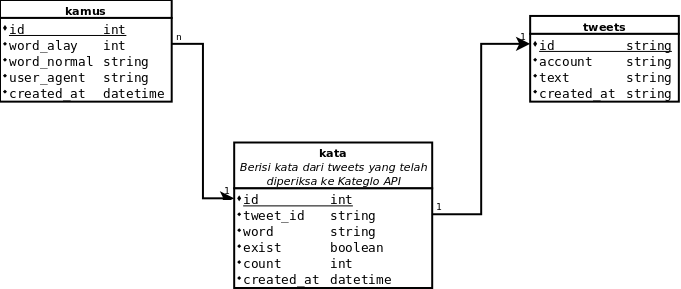

# Bahasa Indonesia Language Processing

Aplikasi ini dibuat untuk membantu membuat kamus kata-kata _alay_ yang ditemukan di media sosial sehingga lebih mudah untuk diproses dan diolah lebih lanjut. Ke depannya, aplikasi ini akan dihubungkan dengan API Kateglo* untuk melakukan pengecekan kata-kata baku yang sudah ada dalam Kamus Besar Bahasa Indonesia.

Untuk menjalankan aplikasi ini secara lokal, silakan _clone_ repositori ini dengan,

    git clone https://github.com/tentangdata/bilp-heroku.git

lalu install `virtualenv`  dengan menggunakan _package manager_ Python

    pip install virtualenv

atau dengan cara apapun yang Anda suka -- mungkin Anda lebih senang mengompilasi semuanya sendiri?

Buatlah folder `venv` pada repositori yang telah Anda _clone_ dengan perintah

    virtualenv venv

Pastikan Anda telah mengaktifkan _virtual environment_ Anda dengan menggunakan perintah

    source venv/bin/activate

Anda dapat melihat bahwa _virtual environment_ sudah aktif dengan melihat tanda `(venv)` di shell Anda. Kemudian, Anda dapat menginstalasi semua _dependency_ yang dibutuhkan dengan menggunakan perintah

    pip install -r requirements.txt

Sekadar informasi, struktur basis data yang akan dikembangkan dapat dilihat di gambar di bawah ini.

Saat ini, baru entitas `kamus` saja yang tersedia. Jadi, bantu kami untuk mengembangkan ini lebih lanjut!

Selamat bereksperimen!

***

*) Dalam konfirmasi
